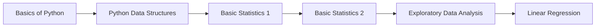
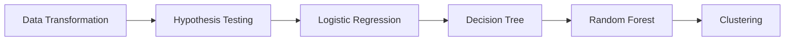
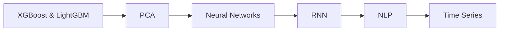

<div align="center">

# 🚀 Data Science, Machine Learning & Deep Learning Repository

### *Your Complete Learning Journey from Python Basics to Advanced AI*

[](https://www.python.org/)
[](https://jupyter.org/)
[](https://scikit-learn.org/)
[](https://www.tensorflow.org/)
[](LICENSE)

**20 Comprehensive Notebooks** | **9 ML Algorithms** | **100% Hands-On** | **Production-Ready Code**

[📚 Explore Notebooks](#-all-notebooks) • [🎯 Quick Start](#-quick-start) • [📖 Learning Paths](#-learning-paths) • [🤝 Contribute](#-contributing)

---

</div>

## 📊 Repository Stats

<div align="center">

| 🐍 Python Basics | 📊 Statistics | 🤖 ML Algorithms | 🧠 Deep Learning | 🎯 Advanced Topics |
|:---:|:---:|:---:|:---:|:---:|
| **3** | **3** | **9** | **2** | **3** |

</div>

---

## 🎯 Why This Repository?

> **Transform Data into Insights, Models into Predictions, and Ideas into Reality**

✅ **Comprehensive Coverage** - From Python basics to advanced deep learning  
✅ **Hands-On Learning** - Real datasets and practical implementations  
✅ **Well-Documented** - Clear explanations and step-by-step guides  
✅ **Industry-Ready** - Production-quality code following best practices  
✅ **Progressive Learning** - Structured path from beginner to advanced  

---

## 📚 All Notebooks

### 🐍 **Python Fundamentals** (3 Notebooks)

<details>
<summary><b>📘 1. Basics of Python</b> - ⭐ Beginner</summary>

**What You'll Learn:**
- Python syntax and structure
- Variables, data types, and operators
- Control flow (if/else, loops)
- Functions and modules
- File handling
- Error handling and exceptions

**Libraries:** Python Standard Library  
**Duration:** 2-3 hours  
**Prerequisites:** None - perfect for beginners!

</details>

<details>
<summary><b>📦 2. Python Data Structures</b> - ⭐ Beginner</summary>

**What You'll Learn:**
- Lists and list comprehensions
- Tuples and immutable data
- Dictionaries and key-value pairs
- Sets and set operations
- Choosing the right data structure
- Performance optimization

**Libraries:** Python Standard Library  
**Duration:** 2-3 hours  
**Prerequisites:** Basic Python

</details>

<details>
<summary><b>🔄 3. Data Transformation</b> - ⭐⭐ Intermediate</summary>

**What You'll Learn:**
- Feature scaling (standardization, normalization)
- Encoding techniques (one-hot, label encoding)
- Handling missing values
- Feature engineering strategies
- Data type conversions
- Pipeline creation for preprocessing

**Libraries:** `pandas`, `numpy`, `scikit-learn`  
**Duration:** 3-4 hours  
**Prerequisites:** Python, Pandas basics

</details>

---

### 📊 **Statistics & Analysis** (3 Notebooks)

<details>
<summary><b>📈 4. Basic Statistics 1</b> - ⭐ Beginner</summary>

**What You'll Learn:**
- Measures of central tendency (mean, median, mode)
- Measures of dispersion (variance, standard deviation)
- Quartiles and percentiles
- Data distribution basics
- Box plots and histograms
- Statistical visualization

**Libraries:** `numpy`, `pandas`, `matplotlib`, `scipy`  
**Duration:** 2-3 hours  
**Prerequisites:** Basic math

</details>

<details>
<summary><b>📊 5. Basic Statistics 2</b> - ⭐⭐ Intermediate</summary>

**What You'll Learn:**
- Probability distributions
- Normal distribution and z-scores
- Correlation and covariance
- Statistical relationships
- Advanced visualization techniques
- Interpreting statistical results

**Libraries:** `numpy`, `pandas`, `scipy`, `seaborn`  
**Duration:** 3-4 hours  
**Prerequisites:** Basic Statistics 1

</details>

<details>
<summary><b>🔬 6. Hypothesis Testing</b> - ⭐⭐ Intermediate</summary>

**What You'll Learn:**
- Null and alternative hypotheses
- T-tests (one-sample, two-sample, paired)
- ANOVA and F-tests
- Chi-square tests
- P-values and significance levels
- Type I and Type II errors
- Real-world applications

**Libraries:** `scipy`, `statsmodels`, `pandas`  
**Duration:** 3-4 hours  
**Prerequisites:** Basic Statistics 1 & 2

</details>

<details>
<summary><b>🔍 7. Exploratory Data Analysis</b> - ⭐⭐ Intermediate</summary>

**What You'll Learn:**
- Data cleaning and preparation
- Univariate and multivariate analysis
- Outlier detection methods
- Correlation analysis
- Advanced visualizations
- Feature relationships
- Data quality assessment

**Libraries:** `pandas`, `matplotlib`, `seaborn`, `plotly`  
**Duration:** 4-5 hours  
**Prerequisites:** Python, Pandas, Statistics

</details>

---

### 🤖 **Machine Learning Algorithms** (9 Notebooks)

<details>
<summary><b>📉 8. Multiple Linear Regression</b> - ⭐⭐ Intermediate</summary>

**What You'll Learn:**
- Linear regression fundamentals
- Multiple features and coefficients
- R-squared and adjusted R-squared
- Residual analysis
- Feature selection techniques
- Model assumptions and validation
- Multicollinearity detection

**Libraries:** `scikit-learn`, `statsmodels`, `pandas`  
**Duration:** 3-4 hours  
**Use Case:** Price prediction, sales forecasting

</details>

<details>
<summary><b>🎯 9. Logistic Regression</b> - ⭐⭐ Intermediate</summary>

**What You'll Learn:**
- Binary classification concepts
- Sigmoid function and odds ratio
- Maximum likelihood estimation
- Confusion matrix and metrics
- ROC curve and AUC
- Multi-class classification (OvR, OvO)
- Threshold optimization

**Libraries:** `scikit-learn`, `pandas`, `matplotlib`  
**Duration:** 3-4 hours  
**Use Case:** Customer churn, disease prediction

</details>

<details>
<summary><b>🌳 10. Decision Tree</b> - ⭐⭐ Intermediate</summary>

**What You'll Learn:**
- Tree-based model structure
- Entropy and information gain
- Gini index and impurity
- Tree pruning techniques
- Feature importance
- Overfitting prevention
- Visualization of decision trees

**Libraries:** `scikit-learn`, `graphviz`, `pandas`  
**Duration:** 3-4 hours  
**Use Case:** Credit approval, medical diagnosis

</details>

<details>
<summary><b>🌲 11. Random Forest</b> - ⭐⭐⭐ Advanced</summary>

**What You'll Learn:**
- Ensemble learning concepts
- Bootstrap aggregating (bagging)
- Random feature selection
- Out-of-bag error estimation
- Feature importance ranking
- Hyperparameter tuning
- Parallel processing

**Libraries:** `scikit-learn`, `pandas`, `matplotlib`  
**Duration:** 4-5 hours  
**Use Case:** Fraud detection, recommendation systems

</details>

<details>
<summary><b>🎪 12. Support Vector Machine</b> - ⭐⭐⭐ Advanced</summary>

**What You'll Learn:**
- Margin maximization concept
- Support vectors and hyperplanes
- Kernel trick (linear, RBF, polynomial)
- Soft margin classification
- SVM for regression (SVR)
- Parameter optimization (C, gamma)
- Multi-class SVM

**Libraries:** `scikit-learn`, `pandas`, `numpy`  
**Duration:** 4-5 hours  
**Use Case:** Image classification, text categorization

</details>

<details>
<summary><b>⚡ 13. XGBoost & LightGBM</b> - ⭐⭐⭐ Advanced</summary>

**What You'll Learn:**
- Gradient boosting fundamentals
- XGBoost algorithm and optimization
- LightGBM and efficiency improvements
- Regularization techniques
- Advanced hyperparameter tuning
- Feature engineering for boosting
- Early stopping and cross-validation
- Handling imbalanced data

**Libraries:** `xgboost`, `lightgbm`, `scikit-learn`  
**Duration:** 4-5 hours  
**Use Case:** Kaggle competitions, financial modeling

</details>

<details>
<summary><b>🔵 14. Clustering</b> - ⭐⭐ Intermediate</summary>

**What You'll Learn:**
- K-Means clustering algorithm
- Elbow method and optimal K
- Hierarchical clustering (agglomerative, divisive)
- DBSCAN for density-based clustering
- Silhouette score and evaluation
- Cluster interpretation
- Real-world segmentation

**Libraries:** `scikit-learn`, `pandas`, `matplotlib`  
**Duration:** 3-4 hours  
**Use Case:** Customer segmentation, market research

</details>

<details>
<summary><b>📐 15. Principal Component Analysis</b> - ⭐⭐⭐ Advanced</summary>

**What You'll Learn:**
- Dimensionality reduction concepts
- Eigenvectors and eigenvalues
- Variance explained
- Component interpretation
- Data visualization in lower dimensions
- Feature extraction
- PCA for noise reduction

**Libraries:** `scikit-learn`, `numpy`, `matplotlib`  
**Duration:** 4-5 hours  
**Use Case:** Image compression, feature reduction

</details>

<details>
<summary><b>⭐ 16. Recommendation System</b> - ⭐⭐⭐ Advanced</summary>

**What You'll Learn:**
- Collaborative filtering techniques
- Content-based recommendations
- Matrix factorization (SVD, NMF)
- User-item interactions
- Similarity metrics (cosine, Pearson)
- Hybrid recommendation systems
- Evaluation metrics (RMSE, precision@k)

**Libraries:** `surprise`, `scikit-learn`, `pandas`  
**Duration:** 4-5 hours  
**Use Case:** Movie recommendations, product suggestions

</details>

---

### 🧠 **Deep Learning** (2 Notebooks)

<details>
<summary><b>🧠 17. Neural Networks</b> - ⭐⭐⭐ Advanced</summary>

**What You'll Learn:**
- Neural network architecture
- Activation functions (ReLU, sigmoid, tanh)
- Forward and backward propagation
- Loss functions and optimization
- Training and validation loops
- Regularization (dropout, L1/L2)
- Batch normalization
- Model architecture design

**Libraries:** `tensorflow`, `keras`, `numpy`  
**Duration:** 5-6 hours  
**Use Case:** Image recognition, pattern detection

</details>

<details>
<summary><b>🔁 18. Recurrent Neural Networks</b> - ⭐⭐⭐ Advanced</summary>

**What You'll Learn:**
- Sequence modeling concepts
- RNN architecture and applications
- LSTM and GRU units
- Handling time dependencies
- Vanishing gradient problem
- Sequence-to-sequence models
- Bidirectional RNNs
- Attention mechanisms

**Libraries:** `tensorflow`, `keras`, `numpy`  
**Duration:** 5-6 hours  
**Use Case:** Time series prediction, language modeling

</details>

---

### 🎯 **Advanced Applications** (2 Notebooks)

<details>
<summary><b>💬 19. NLP Sentiment Analysis</b> - ⭐⭐⭐ Advanced</summary>

**What You'll Learn:**
- Text preprocessing and cleaning
- Tokenization, stemming, and lemmatization
- TF-IDF vectorization
- Word embeddings (Word2Vec, GloVe)
- Sentiment classification models
- Model evaluation for text
- Real-world NLP applications
- Transfer learning with BERT

**Libraries:** `nltk`, `scikit-learn`, `pandas`, `transformers`  
**Duration:** 5-6 hours  
**Use Case:** Social media analysis, review classification

</details>

<details>
<summary><b>📅 20. Time Series Forecasting</b> - ⭐⭐⭐ Advanced</summary>

**What You'll Learn:**
- Time series components (trend, seasonality, noise)
- Stationarity and differencing
- ARIMA modeling (AR, MA, ARMA)
- Seasonal decomposition
- Forecasting and validation
- Prophet for time series
- LSTM for time series
- Evaluation metrics (MAE, RMSE, MAPE)

**Libraries:** `statsmodels`, `prophet`, `pandas`  
**Duration:** 5-6 hours  
**Use Case:** Stock prediction, demand forecasting

</details>

---

## 🚀 Quick Start

### 📋 Prerequisites

Before you begin, ensure you have:
- 🐍 Python 3.8 or higher
- 📓 Jupyter Notebook or JupyterLab
- 💻 Basic command line knowledge

### ⚡ Installation

```bash
# 1️⃣ Clone the repository
git clone https://github.com/Kiran-id10/data-science-machine-learning-and-deep-learning-models.git

# 2️⃣ Navigate to the project directory
cd data-science-machine-learning-and-deep-learning-models

# 3️⃣ Create a virtual environment (recommended)
python -m venv venv

# 4️⃣ Activate the virtual environment
# On Windows:
venv\Scripts\activate
# On macOS/Linux:
source venv/bin/activate

# 5️⃣ Install dependencies
pip install -r requirements.txt

# 6️⃣ Launch Jupyter Notebook
jupyter notebook
```

### 🎯 Using Conda (Alternative)

```bash
# Create and activate environment
conda create -n datascience python=3.9
conda activate datascience

# Install packages
conda install pandas numpy scikit-learn matplotlib seaborn jupyter

# For deep learning
conda install tensorflow keras
```

---

## 📖 Learning Paths

### 🌱 **Beginner Path** (2-3 weeks)

**Goal:** Build a strong foundation in Python and basic statistics



**Notebooks:**
1. Basics of Python
2. Python Data Structures
3. Basic Statistics 1
4. Basic Statistics 2
5. Exploratory Data Analysis
6. Multiple Linear Regression

**Time Commitment:** 15-20 hours  
**Projects:** 2-3 beginner projects

---

### 🌿 **Intermediate Path** (4-6 weeks)

**Goal:** Master core machine learning algorithms



**Notebooks:**
1. Data Transformation
2. Hypothesis Testing
3. Logistic Regression
4. Decision Tree
5. Random Forest
6. Support Vector Machine
7. Clustering

**Time Commitment:** 25-30 hours  
**Projects:** 3-4 intermediate projects

---

### 🌳 **Advanced Path** (6-8 weeks)

**Goal:** Become proficient in advanced ML and deep learning



**Notebooks:**
1. XGBoost & LightGBM
2. Principal Component Analysis
3. Neural Networks
4. Recurrent Neural Networks
5. NLP Sentiment Analysis
6. Time Series Forecasting
7. Recommendation System

**Time Commitment:** 35-40 hours  
**Projects:** 4-5 advanced projects

---

## 🛠️ Tech Stack

<div align="center">

### Core Libraries


### Visualization


### Deep Learning


### Specialized


</div>

---

## 📁 Repository Structure

```
📦 data-science-ml-dl-models/
┣ 📂 01_python_basics/
┃ ┣ 📓 basics_of_python.ipynb
┃ ┣ 📓 python_data_structures.ipynb
┃ ┗ 📓 data_transformation.ipynb
┣ 📂 02_statistics/
┃ ┣ 📓 basic_stats_1.ipynb
┃ ┣ 📓 basic_stats_2.ipynb
┃ ┗ 📓 hypothesis_testing.ipynb
┣ 📂 03_exploratory_analysis/
┃ ┗ 📓 exploratory_data_analysis.ipynb
┣ 📂 04_supervised_learning/
┃ ┣ 📓 multiple_linear_regression.ipynb
┃ ┣ 📓 logistic_regression.ipynb
┃ ┣ 📓 decision_tree.ipynb
┃ ┣ 📓 random_forest.ipynb
┃ ┣ 📓 support_vector_machine.ipynb
┃ ┗ 📓 xgbm_and_lgbm.ipynb
┣ 📂 05_unsupervised_learning/
┃ ┣ 📓 clustering.ipynb
┃ ┗ 📓 principle_component_analysis.ipynb
┣ 📂 06_deep_learning/
┃ ┣ 📓 neural_networks.ipynb
┃ ┗ 📓 recurrent_neural_networks.ipynb
┣ 📂 07_advanced_topics/
┃ ┣ 📓 nlp_sentimental_analysis.ipynb
┃ ┣ 📓 time_series_forecasting.ipynb
┃ ┗ 📓 recommendation_system.ipynb
┣ 📂 datasets/
┃ ┗ 📄 [Sample datasets and data files]
┣ 📂 utils/
┃ ┗ 🐍 helper_functions.py
┣ 📄 requirements.txt
┣ 📄 README.md
┗ 📄 LICENSE
```

---

## 💡 Key Features

| Feature | Description |
|---------|-------------|
| 📚 **Comprehensive** | 20 notebooks covering entire ML/DL spectrum |
| 🎯 **Practical** | Real-world datasets and use cases |
| 📖 **Well-Documented** | Detailed explanations and comments |
| 🔄 **Progressive** | Structured learning from basics to advanced |
| 💻 **Production-Ready** | Clean, modular, reusable code |
| 🎓 **Educational** | Perfect for self-learning and teaching |
| 🔧 **Hands-On** | Code-along exercises and projects |
| 🚀 **Up-to-Date** | Latest libraries and best practices |

---

## 🎓 Recommended Study Plan

### Week 1-2: Foundation
- [ ] Complete Python basics notebooks
- [ ] Understand data structures
- [ ] Learn basic statistics

### Week 3-4: Data Analysis
- [ ] Master data transformation
- [ ] Practice hypothesis testing
- [ ] Perform exploratory data analysis

### Week 5-6: Core ML
- [ ] Implement regression models
- [ ] Build classification models
- [ ] Understand decision trees

### Week 7-8: Advanced ML
- [ ] Master ensemble methods
- [ ] Learn gradient boosting
- [ ] Implement clustering

### Week 9-10: Deep Learning
- [ ] Build neural networks
- [ ] Understand RNNs and LSTMs
- [ ] Apply transfer learning

### Week 11-12: Specialization
- [ ] Master NLP techniques
- [ ] Learn time series forecasting
- [ ] Build recommendation systems

---

## 🤝 Contributing

Contributions make the open-source community amazing! Any contributions are **greatly appreciated**.

### How to Contribute

1. 🍴 Fork the Project
2. 🌿 Create your Feature Branch (`git checkout -b feature/AmazingFeature`)
3. ✍️ Commit your Changes (`git commit -m 'Add some AmazingFeature'`)
4. 📤 Push to the Branch (`git push origin feature/AmazingFeature`)
5. 🎉 Open a Pull Request

### Contribution Ideas

- 📝 Add new notebooks or examples
- 🐛 Fix bugs or improve existing code
- 📚 Improve documentation
- ✨ Add new algorithms or techniques
- 🎨 Enhance visualizations
- 🧪 Add unit tests
- 📊 Include more datasets

---

## 📜 License

Distributed under the MIT License. See `LICENSE` for more information.

---

## 📬 Contact & Support

<div align="center">

**Kiran**

[](https://github.com/Kiran-id10)
[](https://linkedin.com/in/your-profile)
[](mailto:your.email@example.com)

**Found this helpful? Give it a ⭐!**

</div>

---

## 🙏 Acknowledgments

- Inspired by the open-source data science community
- Built with ❤️ for learners and practitioners worldwide
- Special thanks to all contributors and supporters
- Powered by amazing libraries: scikit-learn, TensorFlow, pandas, and more

---

## 📈 Roadmap

- [x] Core Python and Statistics notebooks
- [x] Classical ML algorithms
- [x] Deep Learning fundamentals
- [x] Advanced topics (NLP, Time Series, Recommendations)
- [ ] Computer Vision notebooks
- [ ] Reinforcement Learning
- [ ] MLOps and Deployment guides
- [ ] Kaggle competition walkthroughs
- [ ] Video tutorials
- [ ] Interactive quizzes

---

<div align="center">

### ⭐ If you found this repository helpful, please give it a star!

**Happy Learning! 🚀📊🤖**

*Last Updated: December 2025*

[⬆ Back to Top](#-data-science-machine-learning--deep-learning-repository)

</div>
